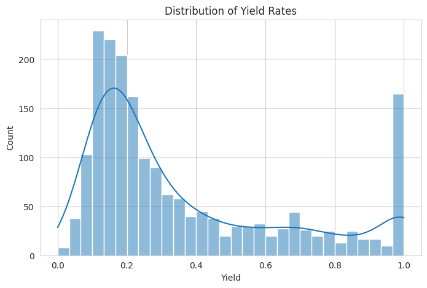
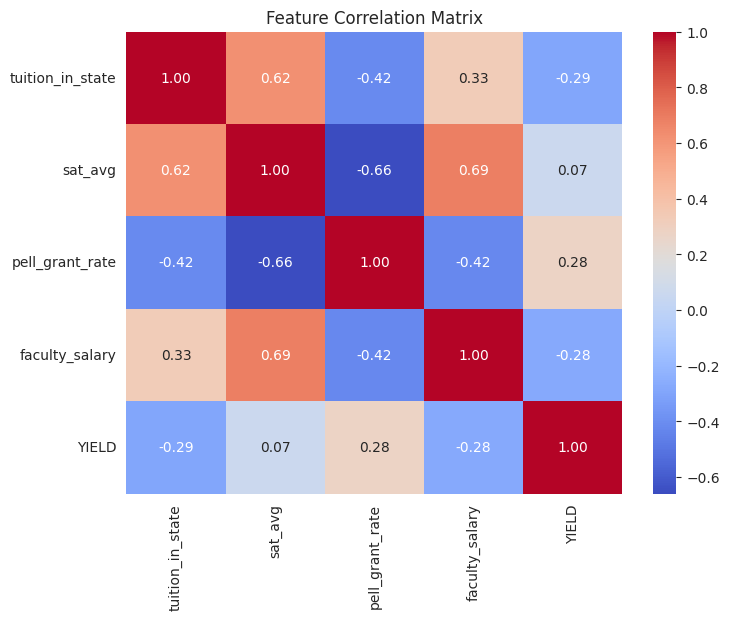
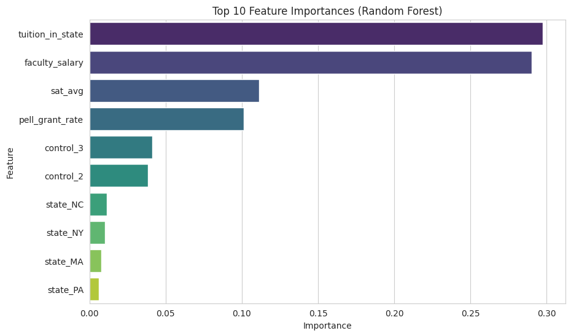
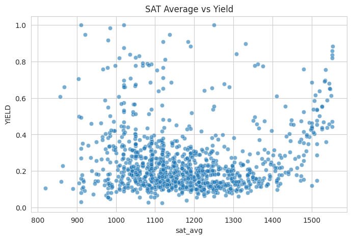

# College Yield Prediction Project

## Overview
**College Yield** refers to the percentage of admitted students who choose to enroll in a specific university. Predicting this metric is crucial for higher education institutions for several reasons:
- **Resource Planning**: Helps in estimating class sizes, housing needs, and course sections.
- **Budgeting**: Tuition revenue is directly tied to enrollment.
- **Admissions Strategy**: Allows universities to adjust acceptance rates to meet enrollment targets without over-enrolling.

This project uses **Deep Learning** to predict yield rates based on institutional data such as tuition costs, SAT scores, Pell grant rates, and faculty salaries.

## Exploratory Data Analysis (EDA)
We performed comprehensive EDA in `notebooks/notebook.ipynb` to understand the factors driving yield.

### 1. Yield Distribution
The distribution of yield rates across universities is visualized to detect skewness and outliers.

- **Insight**: Most universities have a moderate yield, but some highly competitive or specialized institutions have very high yield rates.

### 2. Feature Correlation Matrix
A heatmap showing the correlation between numerical features (Tuition, SAT Avg, Faculty Salary, etc.) and Yield.

- **Insight**: We look for strong positive or negative correlations. For example, `tuition_in_state` and `sat_avg` often show significant correlation with Yield, indicating that cost and prestige are major decision factors for students.

### 3. Feature Importance (Random Forest)
We used a Random Forest Regressor to determine which features contribute most to the prediction.

- **Insight**: The analysis reveals that features like **Tuition**, **State**, and **SAT Scores** are often the strongest predictors of whether an admitted student will enroll.

### 4. Scatter Plots
Visualizations of key relationships, such as **SAT Average vs. Yield**.

- **Insight**: These plots help identify trends, such as whether higher-scoring schools tend to have higher or lower yield rates compared to their peers.

## Model Architecture
The final model is a **Deep Neural Network (DNN)** built with **TensorFlow/Keras**.

- **Preprocessing**: 
  - **Numerical Data**: Imputed with median statistics and scaled using `StandardScaler`.
  - **Categorical Data**: Imputed with most frequent value and One-Hot Encoded.
- **Network Structure**:
  - **Input Layer**: Matches the processed feature space.
  - **Hidden Layers**: Three Dense layers (128, 64, 32 units) with **ReLU** activation.
  - **Regularization**: **Dropout** (30%) and **Batch Normalization** are applied after dense layers to prevent overfitting.
  - **Output Layer**: Single neuron with **Sigmoid** activation to output a probability (Yield rate between 0 and 1).
- **Training**: Optimized using the **Adam** optimizer and **Mean Squared Error (MSE)** loss function.

## How to Recreate Results

### Prerequisites
Ensure you have Python installed. Install dependencies using:
```bash
pip install -r requirements.txt
# Or if using uv/poetry, ensure dependencies in pyproject.toml are installed
```
*Note: Key libraries include `pandas`, `tensorflow`, `scikit-learn`, `flask`, `matplotlib`, `seaborn`.*

### 1. Run the Notebook (EDA & Prototyping)
To see the charts and interactive analysis:
```bash
jupyter notebook notebooks/notebook.ipynb
```
Run all cells to generate the EDA graphs and train the initial model.

### 2. Train the Model (Production)
To train the final model and save the artifacts (`models/yield_model.keras` and `models/preprocessor.pkl`):
```bash
python src/train.py
```

### 3. Serve the Model (API)
To start the Flask prediction service:
```bash
python src/predict.py
```
The service will start on `http://localhost:50001`.

### 4. Docker (Recommended)
You can run the entire project as a container. This handles dependencies, training, and serving automatically.

1. **Build the Image**:
   ```bash
   docker build -t yield-predictor .
   ```
   *Note: This will execute the training script inside the container build process.*

2. **Run the Container**:
   ```bash
   docker run -p 50001:50001 yield-predictor
   ```

3. **Make a Prediction**:
   Once the container is running, use the curl command below.

### 5. Make a Prediction and Parameter Explanation

You can test the API using `curl`:
```bash
curl -X POST -H "Content-Type: application/json" \
     -d '{"school_name": "Test University", "state": "CA", "control": 1, "tuition_in_state": 7000, "sat_avg": 1200, "pell_grant_rate": 0.45, "faculty_salary": 9000}' \
     http://localhost:50001/predict
```

#### Input Parameters Explained
These features were selected based on our EDA as they showed the strongest correlation with Yield.

| Parameter | Description | Why it matters? |
|-----------|-------------|-----------------|
| `school_name` | Name of the institution. | Used for identification (not a feature for the model). |
| `state` | Two-letter state code (e.g., "CA"). | Location affects yield; in-state students are more likely to attend public schools. |
| `control` | Ownership type (`1`: Public, `2`: Private). | Public schools often have higher yields due to lower costs for in-state students. |
| `tuition_in_state` | In-state tuition cost ($). | Price is a major decision factor. High tuition can lower yield unless offset by prestige/aid. |
| `sat_avg` | Average SAT score of admitted students. | Proxy for selectivity/prestige. Highly selective schools often have higher yields. |
| `pell_grant_rate` | Percentage of students receiving Pell Grants. | Indicates the socioeconomic status of the student body. |
| `faculty_salary` | Average monthly faculty salary ($). | Correlates with university resources and quality of education. |

Expected Output:
```json
{
  "predictions": [
    {
      "predicted_yield": 0.25,
      "yield_category": "Low"
    }
  ]
}
```
